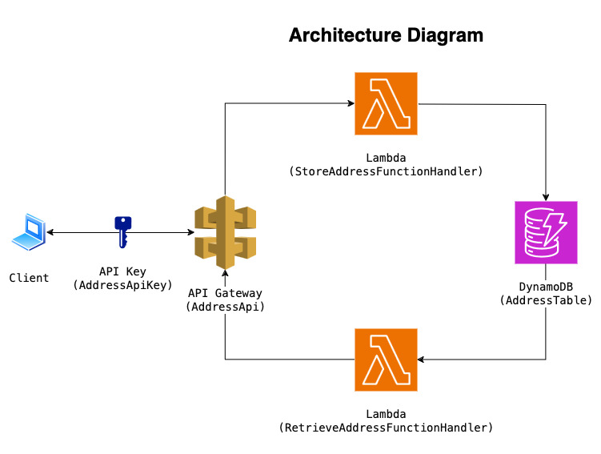

# Serverless API Leveraging AWS Services

This project demonstrates a serverless API for storing and retrieving addresses for a given user, built using AWS services. 
The infrastructure is deployed using AWS Cloud Development Kit (CDK) with JavaScript/TypeScript.

## Features
- **API Gateway**: Exposes HTTP endpoints for CRUD operations.
- **Lambda Functions**: Handles requests and interacts with DynamoDB.
- **DynamoDB**: Stores address data.



**Figure: An architecture diagram of the project**

## Project Structure
- **lib/**: Contains the AWS CDK stack definitions.
- **lambda/**: Contains Lambda function code.
- **bin/**: Entry point for the CDK app.
- **cdk.json**: CDK configuration file.
- **package.json**: Node.js dependencies.

## Prerequisites
To deploy this application, ensure you have the following installed:
- [Node.js](https://nodejs.org/) (v20.x or later)
- [AWS CLI](https://aws.amazon.com/cli/) (configured with credentials)
- [AWS CDK](https://docs.aws.amazon.com/cdk/latest/guide/getting_started.html) (v2.x)
  ```bash
  npm install -g aws-cdk
  ```
  
## Deployment Instructions

### 1. Clone the repository
First, clone this repository to your local machine.

### 2. Install Dependencies
Use `npm` to install the required dependencies.

```bash
npm install
```

### 3. Configure your AWS environment
In `bin/serverless-api-leveraging-aws-services.ts`, follow the comments to configure the AWS environment for 
the CDK stack

### 4. Bootstrap your AWS environment (if necessary)
Before deploying for the first time, bootstrap the CDK in your AWS account:

```bash
cdk bootstrap
```

This command sets up resources needed for CDK deployments in your AWS account.

### 5. Deploy the stack
To deploy the application:

```bash
cdk deploy
```

When prompted, confirm the changes to proceed with deployment.
This will create the required AWS resources: API Gateway, Lambda functions, and DynamoDB table.

### 6. Test the API
Once the stack is deployed, you'll receive an API endpoint URL in the output.
You can find the API key in the AWS Portal under API Gateway.
You can use tools like [Postman](https://www.postman.com/) or [curl](https://curl.se/) to interact with the API.

#### Request Format
```bash
curl -X POST "{{API_URL}}/users/{{userID}}/addresses" \
-H "Content-Type: application/json" \
-H "x-api-key: {{your-api-key}}" \
-d '{
        "street": "{{...}}",
        "suburb": "{{...}}",
        "postcode": "{{...}}"
    }'
```

```bash
curl -X GET "{{API_URL}}/users/{{userID}}/addresses?suburb={{...}}&postcode={{...}}" \
-H "Content-Type: application/json" \
-H "x-api-key: {{your-api-key}}"
```

#### Example Requests
Store an address for a given user:
```bash
curl -X POST "https://my.apiendpoint.com/users/123abc456/addresses" \
-H "Content-Type: application/json" \
-H "x-api-key: myapikeythatisverycool" \
-d '{
        "street": "123 Flinders St",
        "suburb": "Melbourne",
        "postcode": "3000"
    }'
```

Retrieve all addresses for a given user:
```bash
curl -X GET "https://my.apiendpoint.com/users/123abc456/addresses" \
-H "Content-Type: application/json" \
-H "x-api-key: myapikeythatisverycool"
```

Retrieve addresses for a given user that are in the suburb of Melbourne
```bash
curl -X GET "https://my.apiendpoint.com/users/123abc456/addresses?suburb=Melbourne" \
-H "Content-Type: application/json" \
-H "x-api-key: myapikeythatisverycool"
```

### 7. Teardown
To clean up the resources created by the CDK:

```bash
cdk destroy
```

## Useful commands
* `npm run build`   compile typescript to js
* `npm run watch`   watch for changes and compile
* `cdk diff`    compare deployed stack with current state
* `cdk synth`   emits the synthesized CloudFormation template
* `cdk deploy`  deploy this stack to your default AWS account/region

## Steps to get this Production ready
- Infrastructure - Add unit and integration tests
- Infrastructure - Add CDK Pipeline e.g. add dev/test/staging environment
- Infrastructure - Protect the main branch by adding a branch protection rule (can trigger the CDK pipeline on merge into main)
- Infrastructure - Add metrics and monitoring e.g. CloudWatch/AWS X-Ray/AWS Budgets
- Infrastructure - Generate an OpenAPI spec and set up Swagger UI
- DynamoDB - Change removal policy from DESTROY to RETAIN depending on company policy
- DynamoDB - Add backup options to AddressTable e.g. pointInTimeRecovery
- Lambda - Add logging and monitoring
- API Gateway - Usage Plan - Change throttle settings + add quota limits based on expected traffic
- API Gateway - Use AWS Secrets Manager to store the API key generated and set up key rotation
- API Gateway - Add access logging
- API Gateway - Add AWS WAF to protect against common attacks
